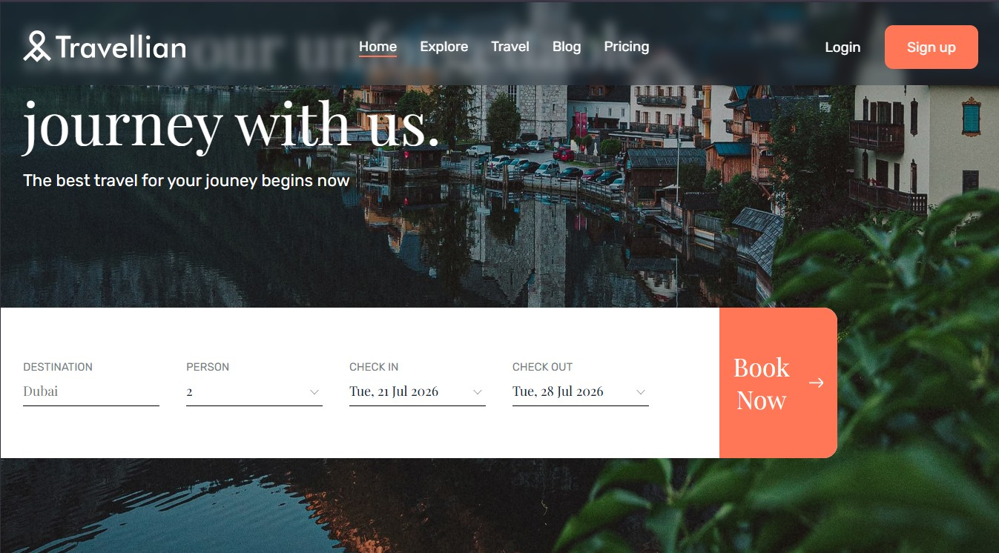

# ✈️ Travellian — Travel Agency Landing Page

Pixel-perfect responsive landing page for a travel agency, built solo from a Figma design — semantic HTML, SCSS (BEM) and a custom Webpack build pipeline.




🔗 **Live demo:** https://lizoksan.github.io/Travellian-Landing-Page/


## Key features

- Built a pixel-perfect implementation of the Figma design, solo, using BEM methodology and a mobile-first approach
- Developed Destination, Offers and Reviews carousels with Swiper.js, with individual settings per breakpoint (1 slide on mobile → up to 3 on desktop)
- Integrated Flatpickr for interactive travel-date selection
- Implemented `.webp` images with a `.jpg` fallback via the `<picture>` element for faster load times
- Fully responsive from 320px (mobile) to 1440px+ (desktop)

## What I learned

- Configuring per-breakpoint Swiper instances (different `slidesPerView`, loop and centering settings for mobile vs desktop) instead of one fixed config
- Setting up a production Webpack pipeline: image optimization (`imagemin`), CSS extraction (`mini-css-extract-plugin`), and auto-deploying the build into `docs/` for GitHub Pages

## Run locally

```bash
git clone https://github.com/lizoksan/Travellian-Landing-Page.git
cd Travellian-Landing-Page
npm install

npm start        # dev server with hot reload
npm run build     # production build → docs/

